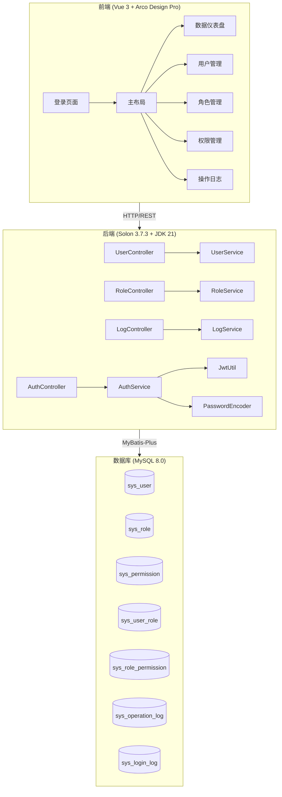
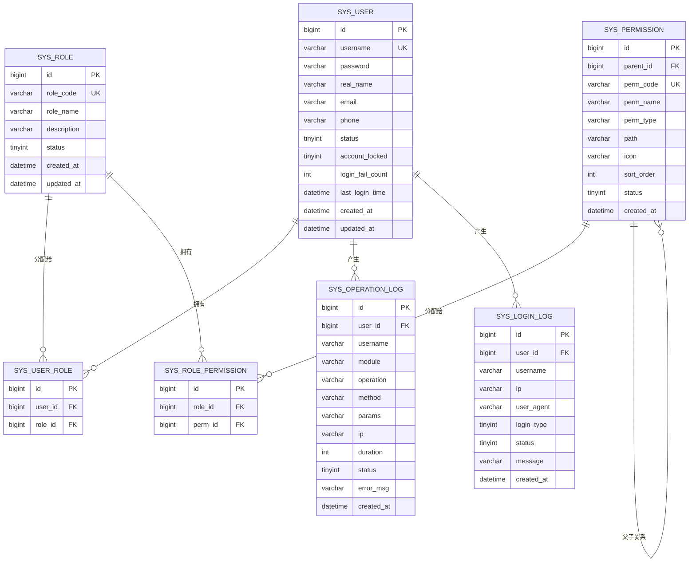

# 风力发电机故障诊断系统 - 项目设计文档

## 1. 系统架构

## 2. ER 图

## 3. 接口清单

### 3.1 AuthController (`/api/auth`)
| 方法 | 路径 | 说明 |
|------|------|------|
| POST | /login | 用户登录 |
| POST | /register | 用户注册 |
| POST | /logout | 用户登出 |
| GET  | /info | 获取当前用户信息 |
| PUT  | /password | 修改密码 |
| POST | /reset-password | 重置密码 |

### 3.2 UserController (`/api/user`)
| 方法 | 路径 | 说明 |
|------|------|------|
| GET  | /page | 分页查询用户 |
| GET  | /{id} | 查询用户详情 |
| POST | / | 新增用户 |
| PUT  | /{id} | 修改用户 |
| DELETE | /{id} | 删除用户 |
| PUT  | /{id}/status | 启用/禁用用户 |
| PUT  | /{id}/lock | 锁定/解锁用户 |
| PUT  | /{id}/roles | 分配角色 |

### 3.3 RoleController (`/api/role`)
| 方法 | 路径 | 说明 |
|------|------|------|
| GET  | /page | 分页查询角色 |
| GET  | /list | 查询全部角色 |
| GET  | /{id} | 查询角色详情 |
| POST | / | 新增角色 |
| PUT  | /{id} | 修改角色 |
| DELETE | /{id} | 删除角色 |
| PUT  | /{id}/permissions | 分配权限 |

### 3.4 PermissionController (`/api/permission`)
| 方法 | 路径 | 说明 |
|------|------|------|
| GET  | /tree | 查询权限树 |
| POST | / | 新增权限 |
| PUT  | /{id} | 修改权限 |
| DELETE | /{id} | 删除权限 |

### 3.5 LogController (`/api/log`)
| 方法 | 路径 | 说明 |
|------|------|------|
| GET  | /operation/page | 分页查询操作日志 |
| GET  | /login/page | 分页查询登录日志 |

## 4. UI/UX 规范

### 4.1 色彩体系（深色科技风）
- 主背景色: `#17171a`
- 侧边栏背景: `#1d1d1f`
- 卡片背景: `#232324`
- 主色调: `#165DFF`（Arco Blue）
- 成功色: `#00B42A`
- 警告色: `#FF7D00`
- 危险色: `#F53F3F`
- 文字主色: `#F2F3F5`
- 文字次色: `#A9AEB8`
- 边框色: `#333335`

### 4.2 字体规范
- 主字体: `'PingFang SC', 'Microsoft YaHei', sans-serif`
- 标题字号: 20px / 16px / 14px
- 正文字号: 14px
- 辅助字号: 12px

### 4.3 间距与圆角
- 卡片圆角: 8px
- 按钮圆角: 4px
- 页面内边距: 24px
- 卡片间距: 16px
- 元素间距: 8px / 12px / 16px

### 4.4 阴影
- 卡片阴影: `0 2px 12px rgba(0, 0, 0, 0.3)`
- 弹窗阴影: `0 4px 24px rgba(0, 0, 0, 0.5)`
